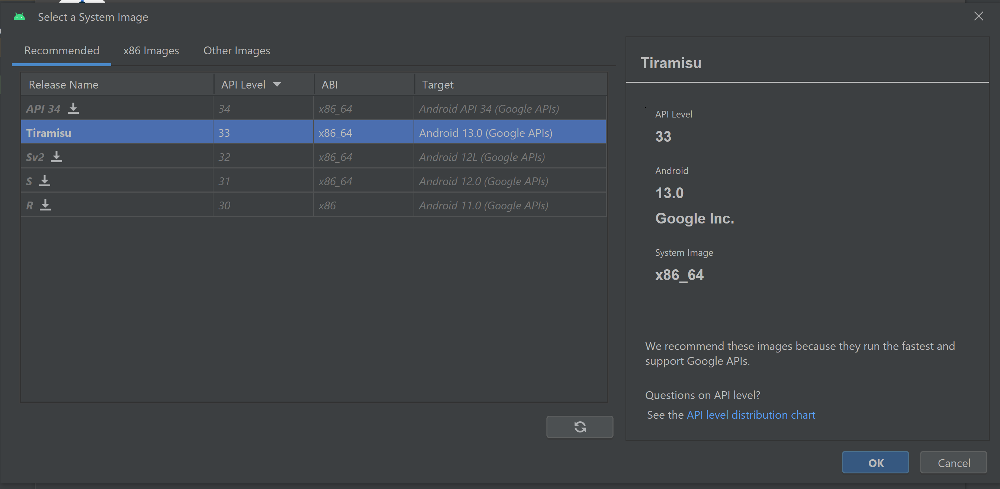
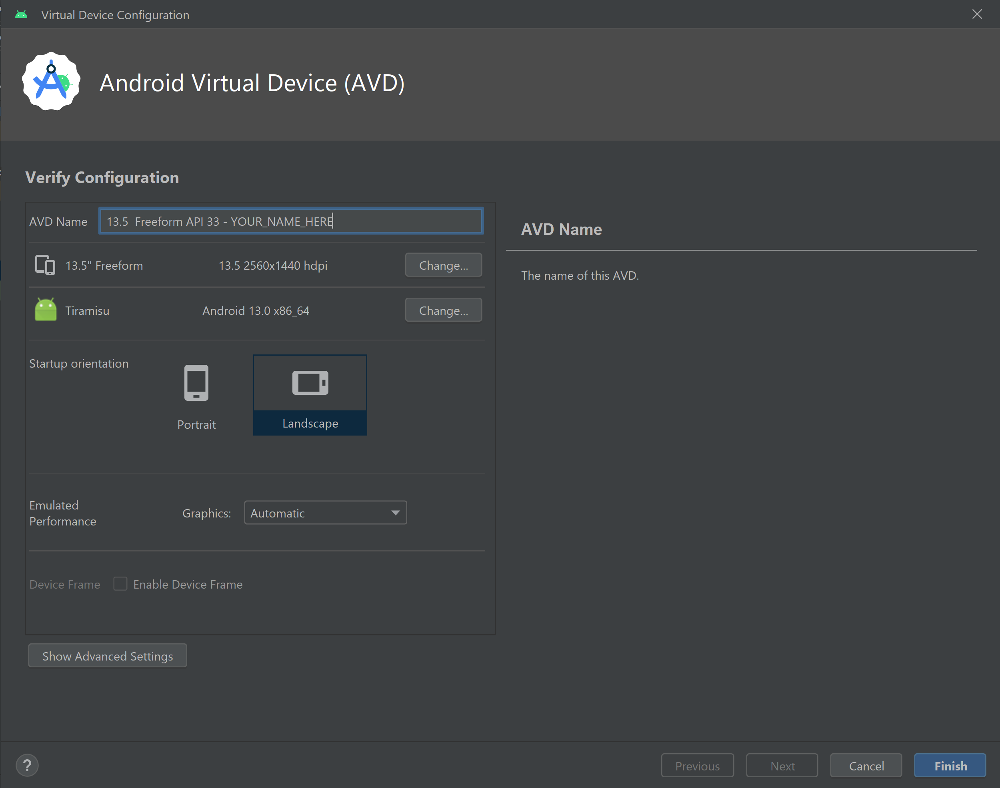

# Expo Nomade

> **Expo Nomade** is a Flutter mobile application developed for the Association Valaisanne des Musées (AVM) to support a traveling exhibition on the theme of migration in Valais. The app is designed for interactive use by adolescents and the general public, and is part of a broader mobile scenographic installation.

---

## 📚 Project Description

Expo Nomade is a tablet-optimized application offering an interactive digital map that showcases historical migration flows, museum objects, and thematic content. The user can apply filters to explore migrations by period, cause, or population type, interact with geographical zones, view multimedia content, and answer quizzes. Results can be sent by email.

The app also includes an administrator interface for CRUD operations on migrations, museums, objects, filters, and quiz content.

---

## 🧪 Technologies Used

| Type             | Name                            | Version |
| ---------------- | ------------------------------- | ------- |
| Language         | Dart                            | 3.1.5   |
| Framework        | Flutter                         | 3.13.2  |
| Mapping          | flutter\_map                    | 5.0.0   |
| Auth & Storage   | Firebase                        | —       |
| State Management | setState + Firebase state sync  | —       |
| DB               | Firebase Realtime Database      |         |
| UI Components    | carousel\_slider, image\_picker |         |

---

## 🌟 Learning Objectives

* Develop a mobile app using Flutter and Firebase
* Create an interactive, filterable map interface
* Implement CRUD operations via admin interface
* Enable user engagement through a quiz system with MCQs, where results can be reviewed and optionally sent to the user's email for reflection or sharing (note: user login is not required)

---

## 🔧 Features

### User side

* Interactive map displaying:

  * Migration flows (polygons)
  * Museum locations (markers)
  * Museum objects (clickable)
* Filters by date, cause, population type
* Quiz with MCQs, score system and email sending
* Multilingual and responsive design

### Admin side

* Secure login ([admin@exponomade.com](mailto:admin@exponomade.com))
* CRUD:

  * Museums
  * Museum objects
  * Migrations
  * Filters
  * Quiz and quiz players

---

## 🛠️ Architecture Overview

* Map-centric UI as entry point
* Firebase Realtime DB sync
* Firebase Auth for admin access
* Firebase Storage for image assets
* Modular Flutter project structure (`lib/` folders for map, quiz, firebase, admin\_forms, etc.)

---

## 🧠 Language Paradigm Principles

* ✅ Declarative UI building with Flutter Widgets
* ✅ Component-based modularity
* ❌ Advanced state management (e.g. BLoC, Riverpod not used)

### Error Handling

* Basic `try/catch` blocks used in Firebase operations
* No centralized error boundary or structured logging implemented

---

## 🏗 Project Structure

### Architecture

* Modular Flutter structure
* Feature-oriented folders for UI, data models, services, and views
* Firebase used for DB, auth and storage integration

### Folder Layout

```
📁 lib
├── 📁 admin_forms
├── 📁 firebase
├── 📁 map
├── 📁 quiz
├── 📁 dataModels
├── 📄 PageManager.dart
├── 📄 sign_in.dart
├── 📄 main.dart
```

---

## 📘 Documentation & Diagrams

* Mockups: included in the `Documentation/` folder
* Architecture diagram: in `TechGuideGroup1.docx`
* Data structure overview: Firebase Realtime DB, 6 primary collections
* User Guide: `UserGuideGroup1.docx`

---

## ✅ Tests & Validation

* Manual validation of each feature per sprint
* Demonstration presented on Sept 9th, 2023
* Functional validation by teachers during final demo
* No automated unit or widget tests implemented

---

---

## 📌 Success Criteria

* Deployed to Google Play Store&#x20;

  * *(note: Firebase Realtime Database is no longer maintained — this app is now archived and not usable without restoring the backend)*
* Bundle built with `flutter build appbundle`
* Signing key configured in `key.properties`
* [Play Store link](https://play.google.com/store/apps/details?id=ch.hevs.expo_nomade)

---

## 📊 Success Criteria

| Criterion                         | Status    | Notes                                                                                                                             |
| --------------------------------- | --------- | --------------------------------------------------------------------------------------------------------------------------------- |
| Interactive map                   | ✅ Done    | Filters, markers, polygons implemented                                                                                            |
| Admin CRUD (museums, flows, etc.) | ✅ Done    | Fully functional                                                                                                                  |
| Firebase DB + storage integration | ✅ Done    | Realtime DB & image storage used                                                                                                  |
| Quiz with result email            | ✅ Done    | Implemented with score tracking                                                                                                   |
| Responsive UI                     | ✅ Done    | Optimized for tablet / emulator                                                                                                   |
| Firebase security rules           | ✅ Done    | Write requires auth                                                                                                               |
| Play Store deployment             | ✅ Done    | Available online                                                                                                                  |
| Multilingual support              | ❌ Missing | Not implemented; no translations or locale switching present. It was not a requirement but would be useful for future deployment. |
| Offline support                   | ❌ Missing | Firebase offline mode not configured. It was not a requirement but would be useful for future deployment.                         |
|                                   |           |                                                                                                                                   |

---

---

## 👤 Authors

* **Milena Lonfat**
* **Luca Del Buono**
* **Elias Borrajo**
* **Alexandre Martroye De Joly**
* **Arnaud Michelet**

---

**Project realized for the course** `645-2 - Flutter Mobile & Web Application Development` **Professors:** Michael Schumacher & Alexandre Cotting
**Institution:** HES-SO Valais-Wallis, Bachelor of Science in Business IT


---


<details>
  <summary>
   <h2>Original README Archive (FR)</h2>
  </summary>

# expo_nomade

Module 642-2

## Documentation
All the documentation of the project is available in the [Documentation](Documentation) folder.

## Getting Started

This project is a starting point for a Flutter application.

A few resources to get you started if this is your first Flutter project:

- [Lab: Write your first Flutter app](https://docs.flutter.dev/get-started/codelab)
- [Cookbook: Useful Flutter samples](https://docs.flutter.dev/cookbook)

For help getting started with Flutter development, view the
[online documentation](https://docs.flutter.dev/), which offers tutorials,
samples, guidance on mobile development, and a full API reference.

## Installation 
1) Installer Flutter sur la machine
2) Installer Android Studio
3) Installer les plugins Flutter et Dart sur Android Studio
4) Clone le projet depuis Git
5) Crée un émulateur Android sur Android Studio
   - 
   - 
   - 
6) Lancer l'émulateur
7) Lancer le projet depuis Android Studio sur l'émulateur Android 
---


</details>

