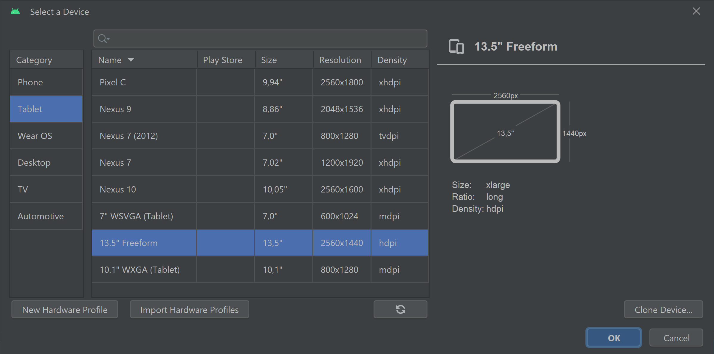

# Expo Nomade 🗺️ – Interactive Heritage Map & Quiz

> **Expo Nomade** is a cross‑platform **Flutter 3** app that guides visitors through a travelling ("nomadic") exhibition of historical artefacts in Valais/Wallis, Switzerland. Users can browse an interactive map, tap points of interest to read rich descriptions, and challenge themselves with location‑aware quizzes.
>
> The project was delivered for the **HES‑SO Course 645‑2 · Flutter Development (2023)** by a four‑student team and is published on Google Play (id: `ch.hevs.expo_nomade`).

---

## 1. English Overview


| Aspect | Details |
|---|---|
| **Purpose** | Bring a cultural exhibit outside museum walls via mobile; learn Flutter |
| **Core Features** | Offline map tiles, artefact detail pages, quiz with score, favourites |
| **Data Sources** | Artefacts & quiz questions stored in **Cloud Firestore** *(exported as JSON for offline fallback)* |
| **Architecture** | Provider + Repository pattern → clean separation UI / domain / data |
| **GIS stack** | `google_maps_flutter` + **GeoJSON** overlays |
| **Other libs** | `geolocator`, `cached_network_image`, `shared_preferences`, `flutter_secure_storage` |
| **CI / CD** | GitHub Actions ➜ EAS Build (Android AAB) |

---

## Features

- **Interactive Map** with custom markers for each artefact (clustered at zoom ≤ 11).
- **Rich Detail View** (markdown descriptions, photos, audio guide support).
- **Quiz Mode** unlocks at each stop; scores stored locally + shared leader‑board in Firestore.
- **Offline Support** (pre‑cached map tiles & artefact bundle).
- **Accessibility** voice‑over labels, large‑text toggle, high‑contrast palette.

---

> **Prerequisites** : Flutter ≥ 3.19 SDK, Dart ≥ 3.3, and an `.env` file containing `GOOGLE_MAPS_API_KEY`.

---

## Project Structure (excerpt)

```
lib/
 ├─ main.dart          # Entry‑point
 ├─ data/              # Repositories + JSON stubs
 ├─ domain/            # Models & business logic
 ├─ presentation/      # Screens, widgets, themes
 └─ services/          # Location, Firestore, analytics
```

---

## 2 · README original (FR)

<details>
  <summary>Clique pour déplier la version française existante</summary>

# expo_nomade

Module 642-2

## Documentation
All the documentation of the project is available in the [Documentation](Documentation) folder.

## Getting Started

This project is a starting point for a Flutter application.

A few resources to get you started if this is your first Flutter project:

- [Lab: Write your first Flutter app](https://docs.flutter.dev/get-started/codelab)
- [Cookbook: Useful Flutter samples](https://docs.flutter.dev/cookbook)

For help getting started with Flutter development, view the
[online documentation](https://docs.flutter.dev/), which offers tutorials,
samples, guidance on mobile development, and a full API reference.

## Installation 
1) Installer Flutter sur la machine
2) Installer Android Studio
3) Installer les plugins Flutter et Dart sur Android Studio
4) Clone le projet depuis Git
5) Crée un émulateur Android sur Android Studio
   - 
   - 
   - 
6) Lancer l'émulateur
7) Lancer le projet depuis Android Studio sur l'émulateur Android 
---


</details>

